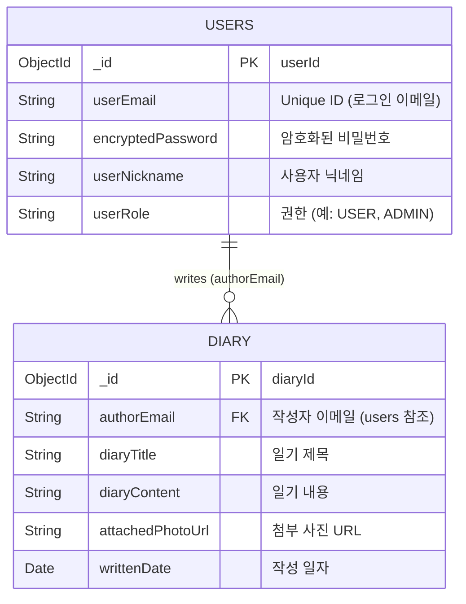

# My-Memory MongoDB 데이터베이스 스키마 문서

**20220910 길재현**

## 개요
- NoSQL인 MongoDB를 사용하며, `diary` 컬렉션은 `users` 컬렉션의 `userEmail` 필드를 참조(Reference)하여 작성자를 식별합니다.
- NoSQL인 관계로 DB구조가 단순하고 컬렉션과 필드명세서 형식으로 작성 합니다.

---

## 1. 스키마 다이어그램 (Collection Diagram)

`USERS (1) ──writes (authorEmail)──> DIARY (N)`

- `users.userEmail` → `diary.authorEmail` (Foreign Key 역할)



---

## 2. 컬렉션 명세

### 2.1. Collection: `users`
회원 정보를 저장하는 컬렉션입니다.

| Field | Type | Description | Index / Constraint |
|---|---|---|---|
| `_id` | ObjectId | MongoDB 자동 생성 식별자 (`userId`에 매핑) | Primary Key |
| `userEmail` | String | 사용자 이메일 (로그인 ID 역할) | Unique |
| `encryptedPassword` | String | 암호화된 사용자 비밀번호 | |
| `userNickname` | String | 사용자 화면 표시 닉네임 | |
| `userRole` | String | 사용자 권한 상태 (Enum 매핑 — 예: `USER`, `ADMIN`) | |

**Sample Document:**
```json
{
  "_id": { "$oid": "64a2b1c3d9ef4a781234abcd" },
  "userEmail": "user@example.com",
  "encryptedPassword": "$2a$10$abcdefghijklmnopqrstuvwxyz12345",
  "userNickname": "작성자",
  "userRole": "USER",
  "_class": "com.jaehyun.diary.entity.UserEntity"
}
```

### 2.2. Collection: `diary`
사용자가 작성한 일기 데이터를 저장하는 컬렉션입니다.

| Field | Type | Description | Index / Constraint |
|---|---|---|---|
| `_id` | ObjectId | MongoDB 자동 생성 식별자 (`diaryId`에 매핑) | Primary Key |
| `authorEmail` | String | 작성자 이메일 (`users` 컬렉션 참조) | Foreign Key 역할 |
| `diaryTitle` | String | 일기 제목 | |
| `diaryContent` | String | 일기 본문 내용 | |
| `attachedPhotoUrl` | String | 첨부된 이미지 객체 URL | |
| `writtenDate` | Date / ISODate | 일기 작성(또는 대상) 일자 | |

**Sample Document:**
```json
{
  "_id": { "$oid": "64a2b9f1e8dc4f895678efgh" },
  "authorEmail": "user@example.com",
  "diaryTitle": "오늘의 일기",
  "diaryContent": "오늘은 날씨가 매우 좋았다. 산책을 다녀왔다.",
  "attachedPhotoUrl": "https://s3.ap-northeast-2.amazonaws.com/my-bucket/photol.jpg",
  "writtenDate": { "$date": "2026-06-11T00:00:00.000Z" },
  "_class": "com.jaehyun.diary.entity.DiaryEntity"
}
```

---

## 3. 컬렉션 간의 관계 (ERD 참조)

| 관계 | 설명 |
|---|---|
| `users` → `diary` | 1:N 관계. 한 명의 사용자가 여러 일기를 작성할 수 있음 |
| **참조 방식** | `diary.authorEmail`이 `users.userEmail`을 참조 (Soft Reference) |
| **참조 키** | `authorEmail` (FK 역할, MongoDB 내장 외래키 미지원으로 애플리케이션 레벨에서 관리) |
