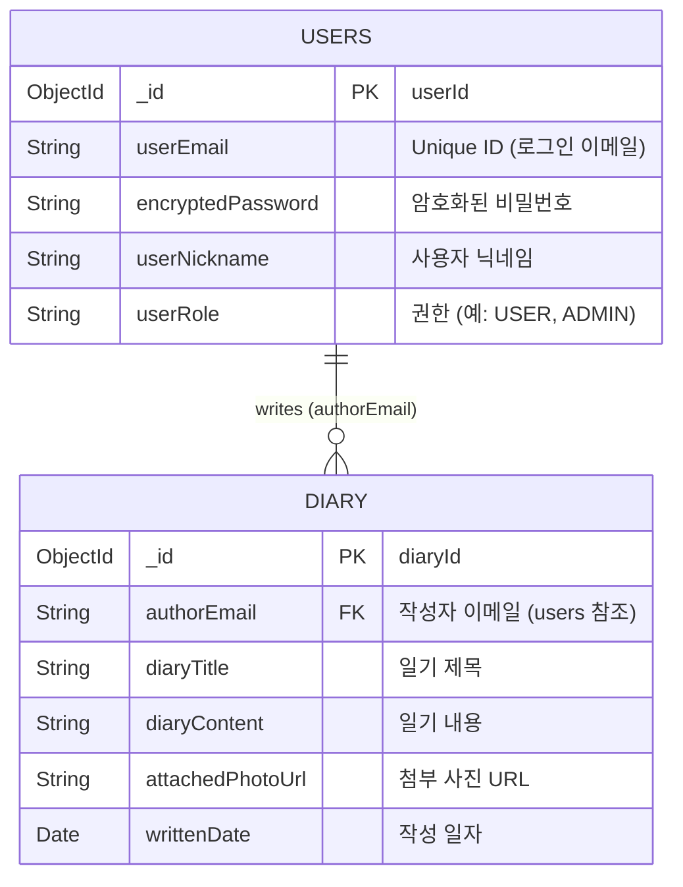

# MongoDB Database Schema

## 1. 스키마 다이어그램 (Collection Diagram)

Diary는 User의 `userEmail`을 참조하여 작성자를 식별합니다.



---

## 2. 컬렉션 명세 및 샘플 JSON

### 2.1. Collection: `users`
회원 정보를 저장하는 컬렉션입니다.

| Field | Type | Description | Index / Constraint |
|---|---|---|---|
| `_id` | ObjectId | MongoDB 자동 생성 식별자 (`userId`에 매핑) | Primary Key |
| `userEmail` | String | 사용자 이메일 (로그인 ID 역할) | Unique |
| `encryptedPassword` | String | 암호화된 사용자 비밀번호 | |
| `userNickname` | String | 사용자 닉네임 | |
| `userRole` | String | 사용자 권한 상태 (Enum 매핑) | |

**[Sample Document]**
```json
{
  "_id": { "$oid": "64a2b1c3d9ef4a781234abcd" },
  "userEmail": "user@example.com",
  "encryptedPassword": "$2a$10$abcdefghijklmnopqrstuvwxyz12345",
  "userNickname": "user1",
  "userRole": "USER",
  "_class": "com.jaehyun.diary.entity.UserEntity"
}
```

### 2.2. Collection: `diary`
사용자가 작성한 일기 데이터를 저장하는 컬렉션입니다.

| Field | Type | Description | Index / Constraint |
|---|---|---|---|
| `_id` | ObjectId | MongoDB 자동 생성 식별자 (`diaryId`에 매핑) | Primary Key |
| `authorEmail` | String | 작성자 이메일 (users 컬렉션 참조) | Foreign Key 역할 |
| `diaryTitle` | String | 일기 제목 | |
| `diaryContent` | String | 일기 본문 내용 | |
| `attachedPhotoUrl` | String | 첨부된 이미지 객체 URL | |
| `writtenDate` | Date/ISODate | 일기 작성(또는 대상) 일자 | |

**[Sample Document]**
```json
{
  "_id": { "$oid": "64a2b9f1e8dc4f895678efgh" },
  "authorEmail": "user@example.com",
  "diaryTitle": "일기 제목 예시",
  "diaryContent": "일기 본문 내용 예시입니다.",
  "attachedPhotoUrl": "https://jaehyun-diary-images-2026.s3.amazonaws.com/be568258-57fe-4696-a67a-e1b6040d0ebb.png",
  "writtenDate": { "$date": "2026-06-15T00:00:00.000Z" },
  "_class": "com.jaehyun.diary.entity.DiaryEntity"
}
```
